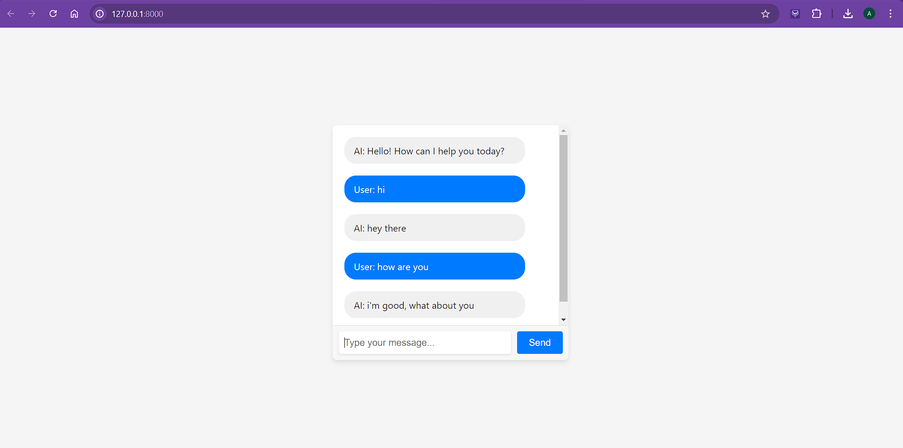

# CHATBOT USING CHATTERBOT IN PYTHON

## Objective
This is a simple chatbot built using chatterbot library provided by python. It is currently under training stage.

## Pre-requisites and required installations:
- **Python 3.7**
- **Libraries**: django, spacy, chatterbot, chatterbot-corpus

## Technology Stack
- **Front-end**: HTML, CSS, JS
- **Framework**: Django

## Project Preview
